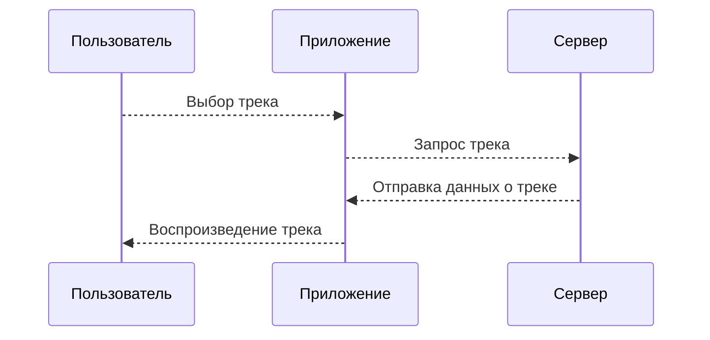
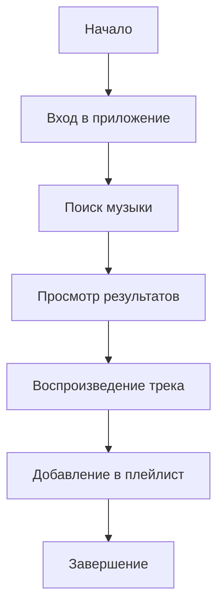
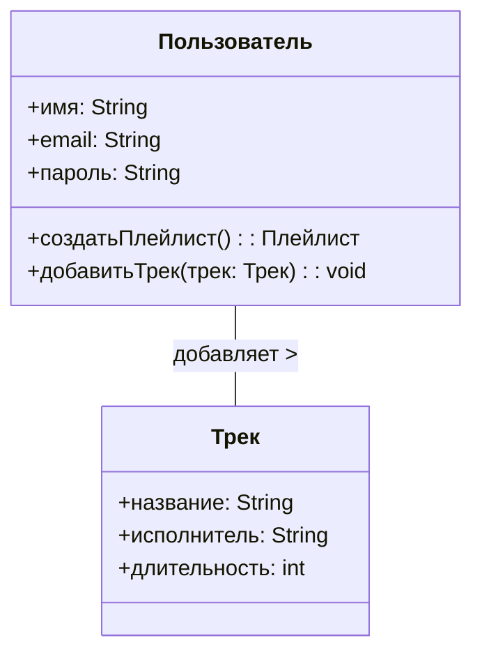

# Apple музыка #   меняю заголовок
ниче не пойму
## 1) *Диаграмма последовательности* ##
### Описание: ###
Эта диаграмма показывает взаимодействие объектов при воспроизведении трека.

### Участники: ###
- Пользователь
- Приложение Apple Music
- Сервер

### Поток событий: ###
1. Пользователь выбирает трек.
2. Приложение запрашивает трек у сервера.
3. Сервер отправляет данные о треке.
4. Приложение начинает воспроизведение.

~~тут могла быть Ваша реклама~~

## 2) *Диаграмма активности* ##
### Описание: ###
Диаграмма активности показывает поток действий в процессе использования приложения Apple Music. Например, пользователь может искать музыку, прослушивать треки, добавлять их в плейлист.

### Элементы: ###
- Начало
- Вход в приложение
- Поиск музыки
- Просмотр результатов
- Воспроизведение трека
- Добавление в плейлист
- Завершение

## 3) *Диаграмма Классов* ##
#### Класс Пользователь:
  - Атрибуты:
    - имя: Имя пользователя.
    - email: Электронная почта пользователя.
    - пароль: Пароль для доступа к учетной записи.
  - Методы:
    - создатьПлейлист(): Метод для создания нового плейлиста.
    - добавитьТрек(трек: Трек): Метод для добавления трека в библиотеку пользователя.

#### Класс Трек:
  - Атрибуты:
    - название: Название трека.
    - исполнитель: Исполнитель трека.
    - длительность: Длительность трека в секундах.
    - 
Связь между классами Пользователь и Трек обозначена стрелкой. Один пользователь может добавлять множество треков.

# 24.09 
## изменения типо 😸

