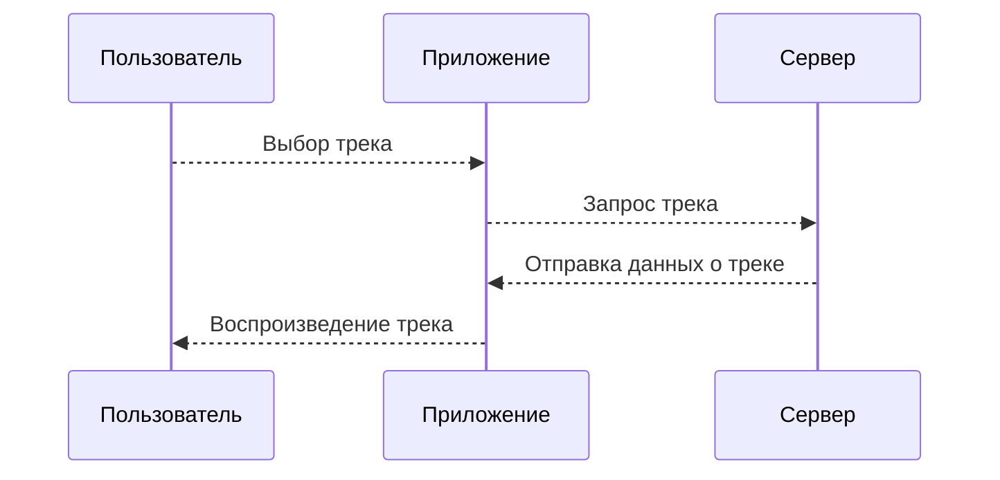
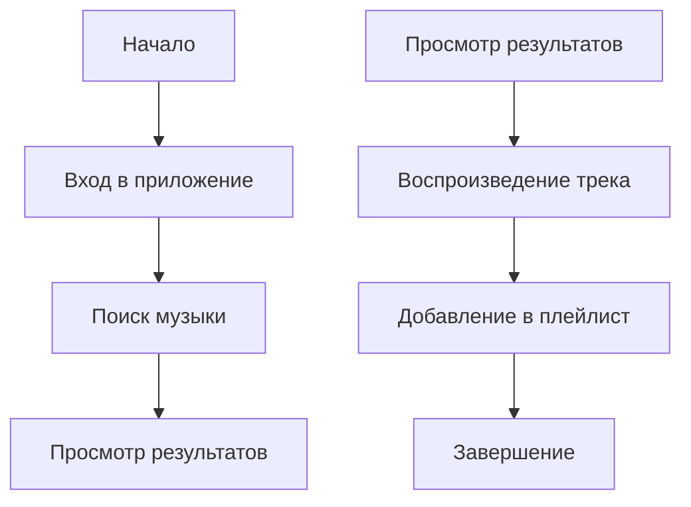
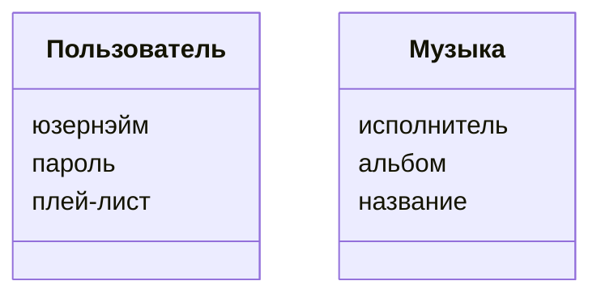

# Apple music #
## 1) *Диаграмма последовательности* ##

```mermaid
sequenceDiagram
Пользователь -->> Приложение: Выбор трека
Приложение -->> Сервер: Запрос трека
Сервер -->> Приложение: Отправка данных о треке
Приложение -->> Пользователь: Воспроизведение трека
```
~~тут могла быть Ваша реклама~~

## 2) *Диаграмма активности* ##

```mermaid
flowchart TD
node1[Начало] --> node2[Вход в приложение] --> node3[Поиск музыки] --> node4[Просмотр результатов]
node5[Просмотр результатов] --> node6[Воспроизведение трека] --> node7[Добавление в плейлист] --> node8[Завершение]

```

## 3) *Диаграмма Классов* ##

```mermaid
classDiagram
    class Пользователь
    Пользователь : юзернэйм
    Пользователь : пароль
    Пользователь : плей-лист
class Музыка
    Музыка : исполнитель
    Музыка : альбом
    Музыка : название
```

