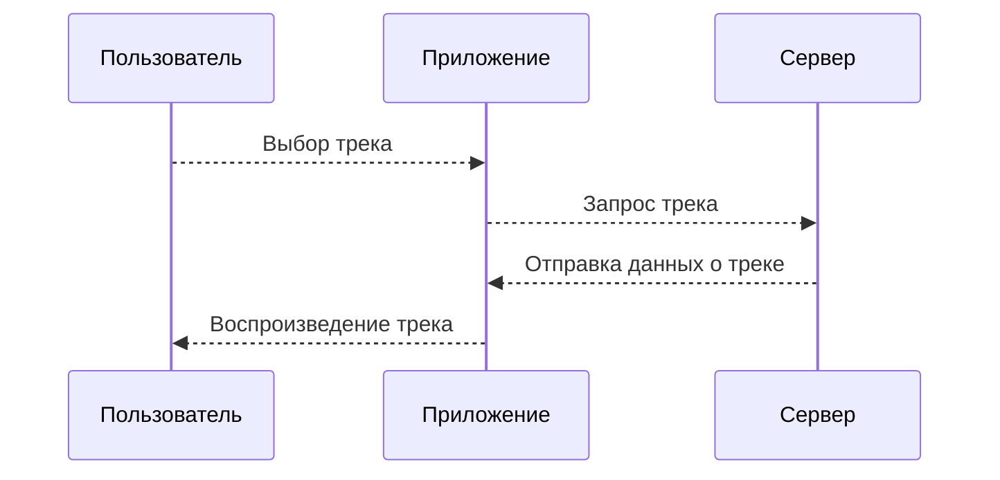
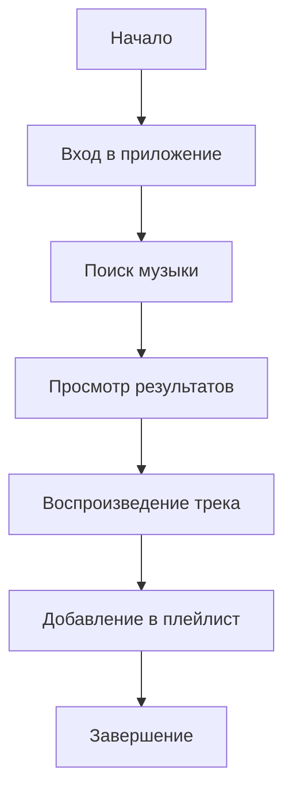

# Apple music #
## 1) *Диаграмма последовательности* ##
### Описание: ###
Эта диаграмма показывает взаимодействие объектов при воспроизведении трека.

### Участники: ###
- Пользователь
- Приложение Apple Music
- Сервер

### Поток событий: ###
1. Пользователь выбирает трек.
2. Приложение запрашивает трек у сервера.
3. Сервер отправляет данные о треке.
4. Приложение начинает воспроизведение.

~~тут могла быть Ваша реклама~~

## 2) *Диаграмма активности* ##
### Описание: ###
Диаграмма активности показывает поток действий в процессе использования приложения Apple Music. Например, пользователь может искать музыку, прослушивать треки, добавлять их в плейлист.

### Элементы: ###
- Начало
- Вход в приложение
- Поиск музыки
- Просмотр результатов
- Воспроизведение трека
- Добавление в плейлист
- Завершение


## 3) *Диаграмма Классов* ##
```mermaid
sequenceDiagram
actor Пользователь
rectangle "Apple Music" {
    Пользователь --> (Регистрация пользователя)
    Пользователь --> (Вход в систему)
    Пользователь --> (Поиск трека)
    Пользователь --> (Прослушивание трека)
    Пользователь --> (Создание плейлиста)
    Пользователь --> (Добавление трека в плейлист)
    Пользователь --> (Удаление трека из плейлиста)
    Пользователь --> (Просмотр альбомов артиста)
}


```


